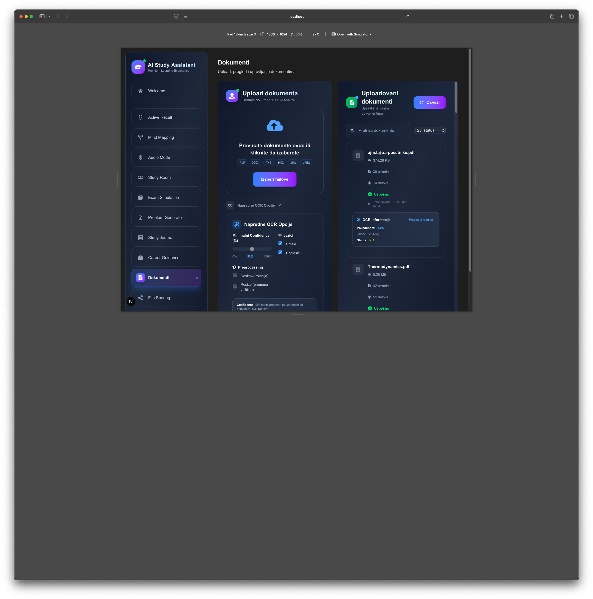
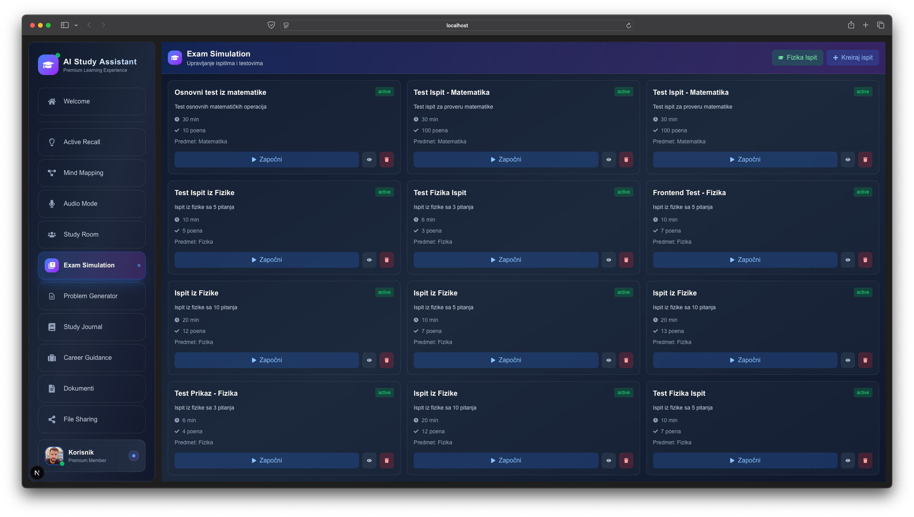

# 🚀 AcAIA - Advanced Context-Aware AI Assistant

## 📋 Šta je AcAIA?

AcAIA je **napredna AI aplikacija** koja kombinije snagu veštačke inteligencije sa modernim web tehnologijama za kreiranje inteligentnog asistenta. Aplikacija je dizajnirana za studente, istraživače i sve one koji trebaju AI podršku za učenje, problem solving i kreativno razmišljanje.

### **🎯 Glavne Funkcionalnosti:**

**🤖 AI Chat & Learning**
- **Inteligentni Chat** sa real-time komunikacijom
- **Exam Simulation** - AI generiše testove i procenjuje odgovore
- **Problem Generator** - Kreira probleme za različite predmete
- **Study Journal** - Praćenje napretka i organizacija materijala

**📚 Document Intelligence**
- **Advanced Document Preview** - Zoom, search, bookmark-ovi
- **OCR Processing** - Automatsko čitanje teksta iz slika
- **Multi-format Support** - PDF, DOC, TXT, slike
- **Smart Search** - Pretraga kroz sve dokumente

**💻 Developer-Friendly**
- **Code Syntax Highlighting** - Podrška za 50+ programskih jezika
- **Real-time Collaboration** - Deljenje sesija i materijala
- **Session Management** - Organizacija razgovora i projekata
- **Export & Sharing** - Izvoz u različitim formatima

**📱 Modern UX/UI**
- **Mobile-First Design** - Potpuno responsive na svim uređajima
- **Voice Input/Output** - Podrška za 12 jezika
- **Virtual Scrolling** - Optimalne performanse sa velikim količinama podataka
- **Accessibility** - WCAG 2.1 compliant

## 📸 Screenshots

### **🏠 Homepage/Dashboard**

*Glavna stranica aplikacije sa modernim interface-om, sidebar navigacijom i responsive design-om*

### **💬 Chat Interface**

*Moderni chat interface sa full-width porukama, code syntax highlighting-om i message actions*

### **📱 Mobile Responsive**

*Mobile-first responsive design sa hamburger menu-om i touch-friendly interface-om*

### **🎓 Exam/Problem Generator**

*AI-powered exam simulation i problem generator sa naprednim funkcionalnostima*

## 🚀 Brzo Pokretanje

### **🐳 Docker (Preporučeno)**
```bash
# Kloniraj repozitorijum
git clone https://github.com/sgazz/AcAI-Light.git
cd AcAI-Light

# Pokretanje sa Docker Compose
docker-compose up --build -d

# Aplikacija će biti dostupna na:
# Frontend: http://localhost:3000
# Backend API: http://localhost:8001
# API Docs: http://localhost:8001/docs
```

### **🔧 Manual Setup**

#### **Backend (FastAPI)**
```bash
cd backend
pip install -r requirements.txt
uvicorn app.main:app --reload --port 8001
```

#### **Frontend (Next.js)**
```bash
cd frontend
npm install
npm run dev
```

## 🏗️ Arhitektura

```
Frontend (Next.js) ←→ Backend (FastAPI) ←→ AI Services
     ↓                    ↓                      ↓
WebSocket Chat    Redis Caching        Query Rewriting
Voice Input       Local Storage        Fact Checking
File Handling     Error Handling       Context Selection
Session Mgmt      Performance Monitor  Multi-step RAG
Mobile Responsive Virtual Scrolling    Code Highlighting
```

## 🛠️ Tech Stack

### **Frontend:**
- **Next.js 15** - React framework sa SSR
- **TypeScript** - Type safety
- **Tailwind CSS** - Utility-first CSS
- **Framer Motion** - Animacije
- **React Virtualized** - Performance optimizacije

### **Backend:**
- **FastAPI** - Modern Python web framework
- **Python 3.11+** - Najnovija Python verzija
- **Redis** - Caching i session storage
- **Pytesseract** - OCR processing
- **Local Storage** - JSON-based data storage

### **DevOps:**
- **Docker** - Containerization
- **Docker Compose** - Multi-service orchestration
- **Nginx** - Reverse proxy
- **Prometheus + Grafana** - Monitoring

## 📊 Status Projekta

### **✅ Završeno (100%):**
- **Core AI Chat** - Real-time komunikacija sa AI
- **Exam Simulation** - Kreiranje, polaganje, brisanje ispita
- **Problem Generator** - AI-powered generisanje problema
- **Document Processing** - OCR, preview, search
- **Mobile Responsive** - Potpuno responsive design
- **Code Highlighting** - Syntax highlighting za 50+ jezika
- **Session Management** - Organizacija i deljenje sesija
- **Docker Integration** - Production-ready deployment
- **Performance Optimizations** - Virtual scrolling, caching
- **Accessibility** - WCAG 2.1 compliance

### **📋 U Razvoju:**
- **Advanced Collaboration** - Real-time saradnja
- **AI Model Integration** - Podrška za različite AI modele
- **Advanced Analytics** - Detaljne analitike korisnika

## 🐳 Docker Deployment

### **Production Setup:**
```bash
# Production build
docker-compose -f docker-compose.prod.yml up --build -d

# Monitoring
docker-compose -f docker-compose.prod.yml logs -f

# Health check
curl http://localhost:8001/health
```

### **Development Setup:**
```bash
# Development build
docker-compose -f docker-compose.dev.yml up --build -d

# Hot reload enabled
# Backend: http://localhost:8001
# Frontend: http://localhost:3000
```

## 📁 Struktura Projekta

```
AcAIA/
├── backend/               # FastAPI backend
│   ├── app/              # Backend aplikacija
│   ├── data/             # Podaci i indeksi
│   └── requirements.txt  # Python dependencies
├── frontend/             # Next.js frontend
│   ├── src/              # Source kod
│   │   ├── components/   # React komponente
│   │   ├── hooks/        # Custom hooks
│   │   └── utils/        # Utility funkcije
│   └── package.json      # Node.js dependencies
├── docs/                 # Dokumentacija
├── tests/                # Test fajlovi
├── uploads/              # Uploaded fajlovi
├── data/                 # Application data
├── Dockerfile           # Docker konfiguracija
└── docker-compose.yml   # Docker orchestration
```

## 🧪 Testiranje

### **Quick Test:**
```bash
# Pokreni test skriptu
./tests/scripts/TestChatIntegration.command

# Ili testiraj ručno:
# 1. Backend: http://localhost:8001/health
# 2. Frontend: http://localhost:3000
# 3. API Docs: http://localhost:8001/docs
```

### **Mobile Testing:**
```bash
# Otvorite Developer Tools (F12)
# Toggle device toolbar (📱 ikona)
# Testirajte: Mobile (375px), Tablet (768px), Desktop (1024px+)
```

## 📈 Performance Metrike

- **Response Time:** < 1 sekunda
- **Memory Usage:** < 500MB
- **Concurrent Users:** > 100
- **Mobile Load Time:** < 2s
- **Docker Build Time:** < 5 minuta
- **Container Size:** < 1GB

## 🤝 Doprinos Projektu

1. Fork projekta
2. Kreiraj feature branch (`git checkout -b feature/amazing-feature`)
3. Commit izmene (`git commit -m 'Add amazing feature'`)
4. Push na branch (`git push origin feature/amazing-feature`)
5. Otvori Pull Request

## 📄 Licenca

Ovaj projekat je licenciran pod MIT licencom - pogledaj [LICENSE](LICENSE) fajl za detalje.

## 📞 Kontakt

- **Projekat:** [AcAIA Repository](https://github.com/sgazz/AcAI-Light)
- **Dokumentacija:** [Master Roadmap](docs/ACAI_MASTER_ROADMAP.md)
- **Issues:** [GitHub Issues](https://github.com/sgazz/AcAI-Light/issues)

---

*AcAIA - Advanced Context-Aware AI Assistant*  
*Status: Production Ready | Verzija: 2.0.0* 